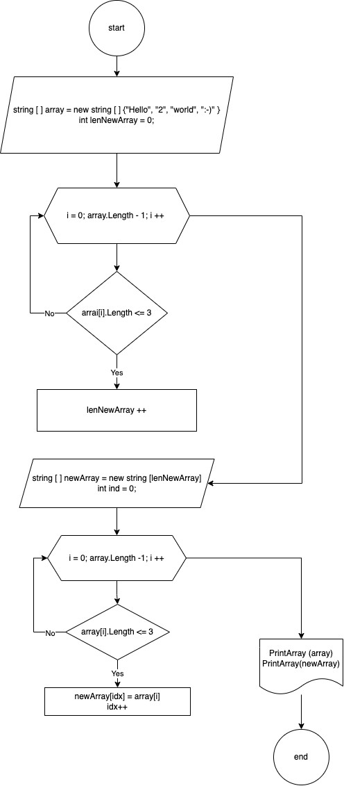

## Задание
- Создать репозиторий на GitHub
- Нарисовать блок-схему алгоритма (можно обойтись блок-схемой основной содержательной части, если вы выделяете её в отдельный метод)
- Снабдить репозиторий оформленным текстовым описанием решения (файл README.md)
- Написать программу, решающую поставленную задачу
- Использовать контроль версий в работе над этим небольшим проектом (не должно быть так, что всё залито одним коммитом, как минимум этапы 2, 3, и 4 должны быть расположены в разных коммитах)
### 1.Репозиторий создан
### 2. Блок-схема

### 3. Текстовый файл создан
Решение:
- Создается исходный массив
- Определяется длина нового массива
- Создается новый массив, выявляются строки, которые должны быть добавлены в новый массив
- Результат выводится в терминал 
### 4. Код программы добавлен
### 5. Коммиты сделаны
